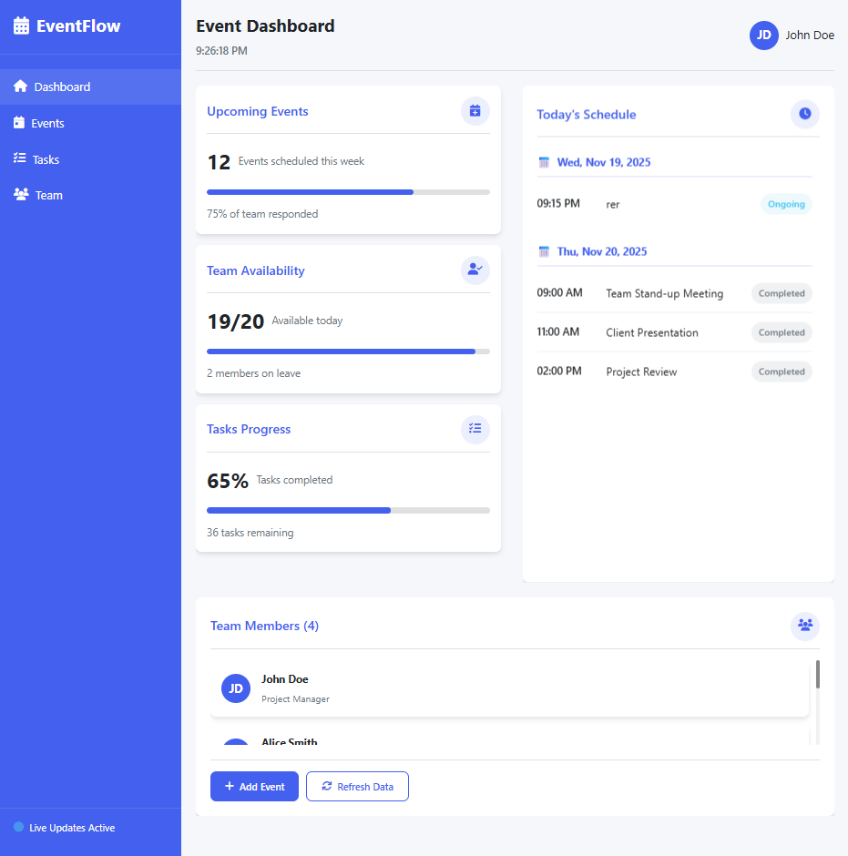
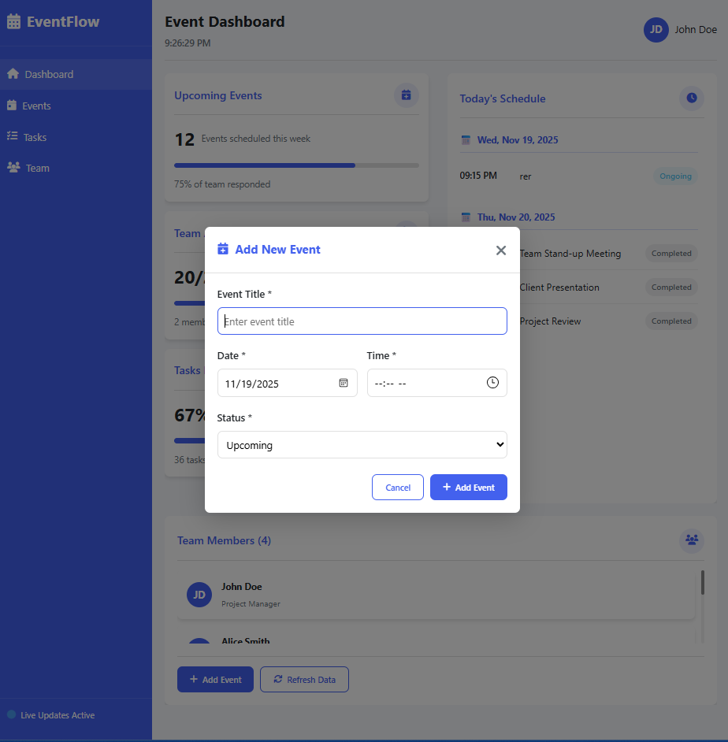

# EventFlow Dashboard

Currently in active development — modular refactor just completed.

A fast, beautiful, real-time event dashboard built with pure vanilla JavaScript.


### Mobile Experience

| Desktop Modal                          | Mobile Modal                           |
|----------------------------------------|----------------------------------------|
|  |  |


## Current Status (November 25, 2025)
- Modular refactor complete
- Mobile sidebar temporarily broken (being fixed right now)
- All 10 Playwright tests written – will be green again soon
- Once mobile UX is solid → v1.0.0

## Current Status (November 25, 2025)

- Desktop experience: Fully working
- Mobile sidebar: Broken after recent refactor (being fixed now)
- All core features implemented
- Playwright tests written but currently failing due to mobile issues
- About to enter bug-squashing phase

## Features (Implemented)

- Create, edit, delete events with date & time
- Events grouped and sorted by date
- Real-time clock and simulated live updates
- LocalStorage persistence
- Gorgeous UI with modals, notifications, loading states
- Fully responsive (when sidebar is fixed)

## Tech Stack

- Vanilla JavaScript (ES6+ modules)
- HTML5 + CSS3 (single perfect stylesheet)
- Font Awesome icons
- No build tools, no frameworks, no dependencies

## Quick Start

```bash
npm run dev
# → opens at http://localhost:5500
```

## Screenshots
#### Dashboard


#### Add Event Modal


